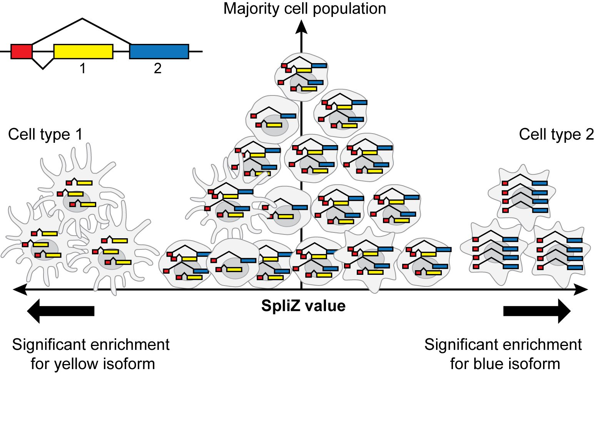
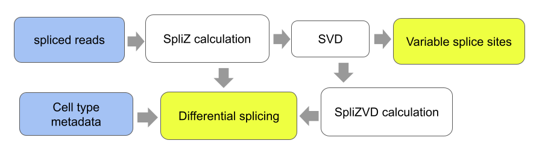

# SpliZ Pipeline



This repository contains code to perform the analyses in the paper ["The SpliZ generalizes “Percent Spliced In” to reveal regulated splicing at single-cell resolution" (Olivieri, Dehghannasiri, and Salzman 2021)](https://www.biorxiv.org/content/10.1101/2020.11.10.377572v2). 

This pipeline takes the output from [SICILIAN](https://github.com/salzmanlab/SICILIAN) and returns the SpliZ for each gene and cell, as well as analyses of differential alternative splicing.




## Installation and setup

Clone this repository:
`$ git clone https://github.com/juliaolivieri/SpliZ_pipeline.git`

`$ cd SpliZ_pipeline/`

Ensure that conda is working on your system. <!-- If you are working on sherlock on the horence partition, you can try adding `export PATH="/share/PI/horence/applications/anaconda3/bin/:$PATH"` to your .bashrc. -->
Then set up the conda environment from the environment.yml file:

`$ conda env create --name spliz_env --file=environment.yml`

and activate it:

`$ source activate spliz_env`

If this activation step doesn't work, try running `conda env list` and looking for the path that ends with `spliz_env`. Then run `source activate <full path>`. <!-- for example `source activate /share/PI/horence/applications/anaconda3/envs/spliz_env`. -->

This whole process should take less than 5 minutes on a normal computer.

## Running the pipeline on test data

Use the following command to run the pipeline on the small test dataset (labeled `test` in the `data` folder):

`snakemake -p --config datasets="test" --restart-times 0`

This should take less than 5 minutes to run on a local computer with at least 3 Gb free space.

After the pipeline has completed, you can check your results by comparing the file `scripts/output/final_summary/summary_test_compartment-tissue_100_S_0.1_z_0.0_b_5.tsv` with the sample output file `test_pvals_compartment-tissue_100_S_0.1_z_0.0_b_5.tsv` in the main directory.

## Downloading data from paper

You will need to place the following files in the "data" directory, accessible on [figshare](https://figshare.com/articles/dataset/Tables_and_Data_for_SpliZ_Manuscript/14378819):
* `HLCA4_P2_10x_with_postprocessing_lung.pq`
* `HLCA4_P3_10x_with_postprocessing_lung.pq`

<!--
And the following file in the util_files directory:
* `GRCh38_latest_genomic.gtf`

If you are working on Sherlock with access to the horence partition, you can run 

`cp /oak/stanford/groups/horence/JuliaO/SZS_data/* data/`

and

`cp /oak/stanford/groups/horence/JuliaO/gtf_files/GRCh38_latest_genomic.gtf util_files/`

to get these files.
-->

## Running the pipeline

Names of datasets to run on are specified in the `config.yaml` file. To run, use `snakemake -p`. To run on different datasets, either change the values in the `config.yaml` file, or override them at the command line: `snakemake -p --config datasets="my_data_name"`. You can run `snakemake -np` first to see what jobs will be run. Each job automatically re-submits itself two times if it fails, so if you want to run without these resubmissions you can run `snakemake -p --restart-times 0`.

The terminal window you submit from will not be available again until after the full pipeline runs. You can use tmux to subset your termianl pane so that snakemake is only running in one box (this also allows you to detatch the session so it continues running even when terminal isn't open). For the tmux approach you will have to always log in to the same node so you can reconnect to the same session. 

The pipeline should take around one hour to run on the full dataset.

To set up snakemake to run on slurm, you can follow the directions here: [https://github.com/Snakemake-Profiles/slurm](https://github.com/Snakemake-Profiles/slurm). <!-- If you are working on sherlock using the horence partition, you can try copying the folder `/oak/stanford/groups/horence/JuliaO/snakemake/` to `~/.config` by running `cp -r /oak/stanford/groups/horence/JuliaO/snakemake ~/.config/` instead. You can then edit `~/.config/snakemake/slurm/slurm-submit.py` to change the `SBATCH_DEFAULTS` variable if you want (the current defaults are to use the partitions owners and horence, 10 minutes of time, and 4Gb of memory). --> All of the time and memory requirements for the SpliZ pipeline are specified in the script itself, so you don't need to change these variables if you're only running this pipeline.

## Input file format
This pipeline works with the "class input file" output of the [SICILIAN pipeline](https://github.com/salzmanlab/SICILIAN). To run the pipeline without running SICILIAN first, your data must be a tsv or parquet file with one row per cell+junction with the following columns:

* `cell`: Cell identifier
* `chrR1A`: The chromosome the gene is on
* `geneR1A_uniq`: The gene name
* `strand`: The strand of the gene (+ or -)
* `juncPosR1A`: The 5' end of the splice junction
* `juncPosR1B`: The 3' end of the splice junction
* `numReads`: The number of reads mapping to this junction in the given cell
* `called`: Column that is 1 for all junctions that should be included in the analysis, 0 otherwise
* `free_annotation`: The most specific annotation of the cells (e.g. cell type)
* `compartment`: The next most specific annotation of the cells (every value in the column can be the same)
* `tissue`: The most general annotation of the cells (every value in the column can be the same)

An example input file is given in `data/test.tsv`.


## Output files

### SpliZ values

The SpliZ values for the dataset can be found in this output file:

* `scripts/output/rijk_zscore/<dataname>_sym_SVD_normdonor_S_0.1_z_0.0_b_5_subcol.tsv` (for test, `scripts/output/rijk_zscore/test_sym_SVD_normdonor_S_0.1_z_0.0_b_5_subcol.tsv`)

This output file has one line per cell per gene with enough spliced reads to calculate a SpliZ value. The column values are:

* `cell`: The cell identifier
* `geneR1A_uniq`: The gene
* `tissue`, `compartment`, `free_annotation`, `ontology`: Metadata columns associating each cel with a cell type
* `scZ`: SpliZ value
* `n.g_A`: Number of reads mapping to the 5' splice sites used for the SpliZ calculation in this gene and this cell
* `n.g_B`: Number of reads mapping to the 3' splice sites used for the SpliZ calculation in this gene and this cell
* `svd_z0`: The SpliZVD score based on the first eigenvector
* `svd_z1`: The SpliZVD score based on the second eigenvector
* `svd_z2`: The SpliZVD score based on the third eigenvector

### Differential SpliZ analysis

Results of the differential SpliZ analysis can be found in this file:

* `scripts/output/final_summary/summary_<dataname>_ontology-tiss_comp_100_S_0.1_z_0.0_b_5.tsv` (for test, `scripts/output/final_summary/summary_test_ontology-tiss_comp_100_S_0.1_z_0.0_b_5.tsv`)

There is one row per gene per group and cell type. The columns of the file are defined as follows:

* `gene`: the gene name
* `sub_col`: The metadata column the data was subset on for analysis (in this example, `tiss_comp`)
* `group_col`:  The metadata column differential analysis was performed on with `sub_col` (in this example, `ontology`)
* `SpliZsites`: The SpliZsites isolated for this gene by the first three eigenvectors (separated by commas)
* `<z_col>_median`: The median of the SpliZ(VD) values for the given `gene`, `sub_col`, and `group_col`. `z_col` can be `scZ`, `svd_z0`, `svd_z1`, or `svd_z2`.
* `<z_col>_pval`: The BH adjusted p value of the SpliZ(VD) values for the given `gene` and `sub_col`.`z_col` can be `scZ`, `svd_z0`, `svd_z1`, or `svd_z2`.

### SpliZsites

A separate file is created based on each of the first three eigenvectors:

* `scripts/output/SpliZsites/<dataname>_ontology-tiss_comp_100_S_0.1_z_0.0_b_5.tsv` (for test, `scripts/output/SpliZsites/test_ontology-tiss_comp_100_S_0.1_z_0.0_b_5.tsv`)
* `scripts/output/SpliZsites/second_evec_<dataname>_ontology-tiss_comp_100_S_0.1_z_0.0_b_5.tsv` (for test, `scripts/output/SpliZsites/second_evec_test_ontology-tiss_comp_100_S_0.1_z_0.0_b_5.tsv`)
* `scripts/output/SpliZsites/third_evec_<dataname>_ontology-tiss_comp_100_S_0.1_z_0.0_b_5.tsv` (for test, `scripts/output/SpliZsites/third_evec_test_ontology-tiss_comp_100_S_0.1_z_0.0_b_5.tsv`)

Each of these files contains the following columns:

* `gene`: gene name
* `let`: Either A or B depending on whether the splice site is 5' or 3'
* `end`: the SpliZsite coordinate that is one of the most variable for this splice site


## Software dependencies

These are also found in the `environment.yml` file.

```
    - python=3.6.7
    - pandas=1.0.4
    - tqdm=4.46.0
    - numpy=1.18.4
    - snakemake-minimal=5.4.5=py_0
    - pyarrow=0.15.1
    - r-base=4.0.2
    - r-data.table=1.14.0
    - r-rfast=2.0.3
    - scipy=1.4.1
    - statsmodels=0.11.1
 ```

## References
Olivieri, Dehghannasiri, and Salzman. "The SpliZ generalizes “Percent Spliced In” to reveal regulated splicing at single-cell resolution." bioRxiv. (2020) [https://www.biorxiv.org/content/10.1101/2020.11.10.377572v2](https://www.biorxiv.org/content/10.1101/2020.11.10.377572v2).

Dehghannasiri, Olivieri, and Salzman. "Specific splice junction detection in single cells with SICILIAN," bioRxiv. (2020) [https://www.biorxiv.org/content/10.1101/2020.04.14.041905v1](https://www.biorxiv.org/content/10.1101/2020.04.14.041905v1).
